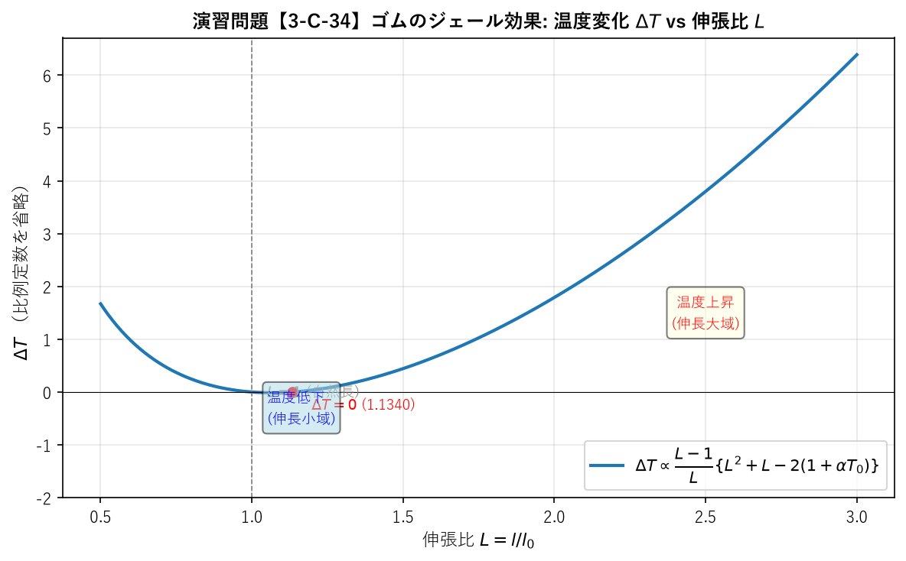

# 演習問題【3-C-34】

## 解答

ゴムの断熱伸長に伴う温度変化 $\Delta T$ を求めるために，まず断熱過程における温度と長さの関係を導出する．

### 1. 断熱過程における温度変化の式

熱力学第一法則とエントロピーの定義に基づくと，断熱過程（エントロピー変化 $dS = 0$ ）における温度 $T$ と長さ $l$ の関係は，次のように与えられる：

$$\left( \frac{\partial T}{\partial l} \right)_s = - \frac{\left( \frac{\partial S}{\partial l} \right)_T}{\left( \frac{\partial S}{\partial T} \right)_l} \quad \cdots (1)$$

ここで， $(\partial S / \partial T)_l = C_l / T$ （ $C_l$ は長さ一定の熱容量）であることを用いると，式(1)は次のように書き換えられる：

$$\left( \frac{\partial T}{\partial l} \right)_s = \frac{T}{C_l} \left( \frac{\partial X}{\partial T} \right)_l \quad \cdots (2)$$

ここで， $X$ は全張力であり，ヘルムホルツの自由エネルギー $F$ の微分形式 $dF = -S dT + X dl$ から得られるマクスウェルの関係式 $(\partial S / \partial l)_T = -(\partial X / \partial T)_l$ を用いることで，式(2)は導かれる．

問題文で与えられた張力 $X$ の式：

$$X = AT \left[ \frac{l}{l_0} - \{1 + \alpha(T - T_0)\} \left(\frac{l_0}{l}\right)^2 \right]$$

において，長さの比を $R = l/l_0$ とおくと，

$$X = AT \left[ R - \{1 + \alpha(T - T_0)\} R^{-2} \right]$$

となる．
この式を温度 $T$ で偏微分し， $T = T_0$ のときを考えると：

$$\left( \frac{\partial X}{\partial T} \right)_l = A \left[ R - \{1 + \alpha(T - T_0)\} R^{-2} \right] + AT \left[ -\alpha R^{-2} \right]$$

$$T = T_0 \text{ において， }$$

$$\left( \frac{\partial X}{\partial T} \right)_l = A \left[ R - R^{-2} \right] - \alpha A T_0 R^{-2}$$

となる．
これを式(2)に代入し，再び $R = l/l_0$ と戻すと，断熱過程における温度勾配は以下のようになる：

```math
\left( \frac{\partial T}{\partial l} \right)_s = \frac{T_0}{C_l} A \left\{ \frac{l}{l_0} - (1 + \alpha T_0) \left( \frac{l_0}{l} \right)^2 \right\} \quad \cdots (3)
```

### 2. 温度変化 $\Delta T$ の計算

自然の長さ $l_0$ から $L$ 倍の長さ $L l_0$ まで断熱的に引き伸ばすときの温度変化 $\Delta T$ は，式(3)を $l_0$ から $L l_0$ まで積分することで求められる．
$l = l_0 L$ より $dl = l_0 dL$ であることに注意すると，

```math
\Delta T = \int_{l_0}^{L l_0} \left( \frac{\partial T}{\partial l} \right)_s dl = \int_{1}^{L} \frac{T_0 A l_0}{C_l} \left\{ L - (1 + \alpha T_0) L^{-2} \right\} dL
```

$$\Delta T = \frac{T_0 A l_0}{C_l} \left[ \frac{1}{2} L^2 + (1 + \alpha T_0) L^{-1} \right]_1^L$$

```math
\Delta T = \frac{T_0 A l_0}{C_l} \left\{ \left( \frac{1}{2} L^2 + \frac{1 + \alpha T_0}{L} \right) - \left( \frac{1}{2} + 1 + \alpha T_0 \right) \right\}
```

```math
\Delta T = \frac{T_0 A l_0}{C_l} \left\{ \frac{L^3 + 2(1 + \alpha T_0) - (3 + 2\alpha T_0)L}{2L} \right\}
```

これを整理すると，解答例の形式が得られる：

$$\Delta T = \frac{A l_0}{2 C_l} T_0 \frac{L-1}{L} \{L^2 + L - 2(1 + \alpha T_0)\} \quad \cdots (4)$$

### 3. 結果の図示

式(4)を $L$ の関数として図示する．
プロットに用いるのは比例定数を省略した無次元形：

$$\Delta T \propto \frac{L-1}{L}\{L^2+L-2(1+\alpha T_0)\}$$

ただし $\alpha = 7 \times 10^{-4} \, \text{deg}^{-1}$，$\alpha T_0 \approx 0.21$ （ $T_0 \approx 300 \, \text{K}$ ）とする．
$L < L_{\mathrm{crit}} \equiv \dfrac{-1+\sqrt{1+8(1+\alpha T_0)}}{2} \approx 1.134$ の範囲では $\Delta T < 0$ （温度低下），
$L > L_{\mathrm{crit}}$ で $\Delta T > 0$ （温度上昇）となる．



## 解説

### 熱力学の基本概念

この問題では，物質を引き伸ばしたときに温度がどう変わるかという，直感とは異なる現象（ゴムのジュール効果）を扱っている．

1. **断熱過程とは**：
   外部との熱のやり取りがない状態を指す．
   このとき，物質の内部エネルギーの変化は，すべて「仕事」として使われる．
   ゴムを引き伸ばすという「仕事」をしたとき，そのエネルギーがどのように温度（内部エネルギー）に反映されるかを考えるのがこの問題の核心である．

2. **エントロピーとマクスウェルの関係式**：
   エントロピー $S$ は，系の乱雑さを表す量である．
   熱力学では，温度や圧力，体積，エントロピーなどの変数には互いに結びつき（微分関係）がある．
   マクスウェルの関係式は，目に見えないエントロピーの変化を，測定可能な張力 $X$ や長さ $l$ の変化として捉えるための非常に強力な道具である．

3. **なぜゴムを伸ばすと温かくなるのか？**
   通常の金属などは引き伸ばすと温度が下がることが多いが，ゴムは逆に温度が上がる．
   これは，ゴムの分子が「絡まり合った状態（エントロピーが低い）」から「引き伸ばされて整列した状態（エントロピーが高い）」へと変化しようとする性質を持っているためである．
   この「エントロピーが増えようとする力」が，引き伸ばす際に熱を発生させる原因となる．

4. **熱膨張との関係**：
   グラフの最初で温度が少し下がるのは，ゴムが持つ「熱膨張」という性質が，引き伸ばしによる温度上昇効果よりも一時的に強く働くためである．
   しかし，引き伸ばしの程度 $L$ が大きくなると，ゴム弾性によるエントロピー変化の効果が圧倒的に大きくなり，温度は急激に上昇する．
